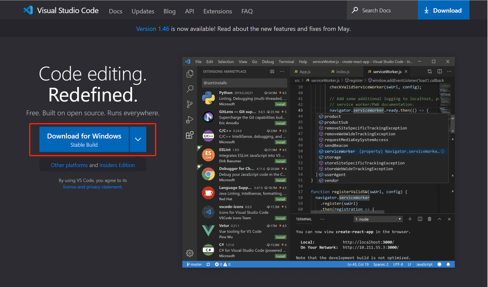
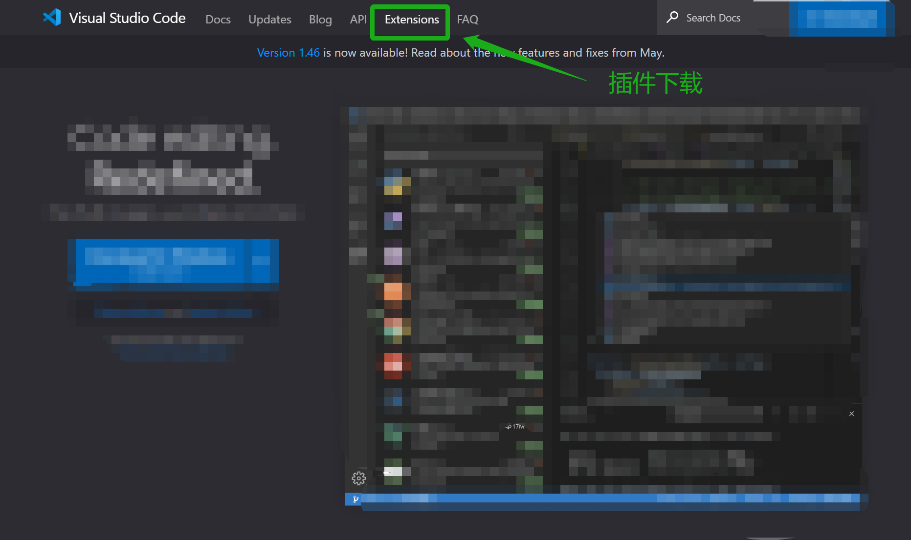
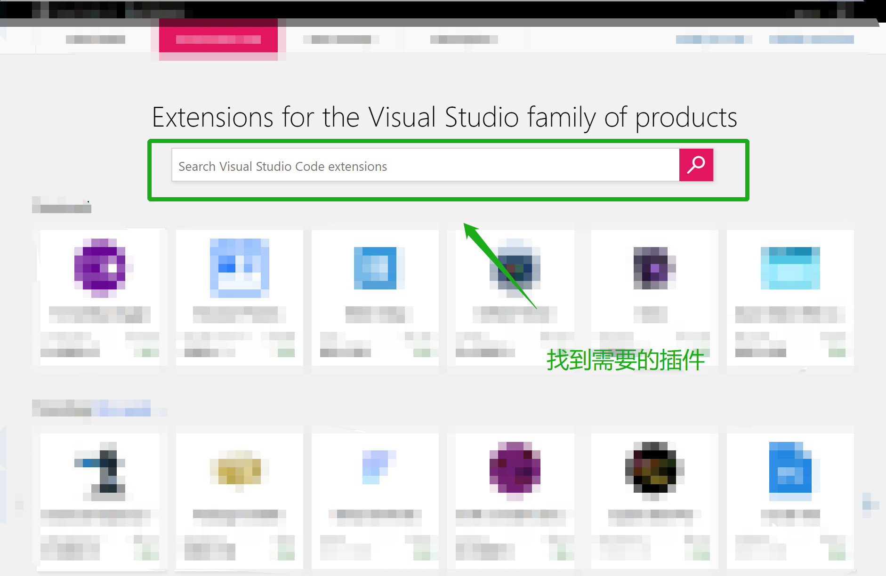
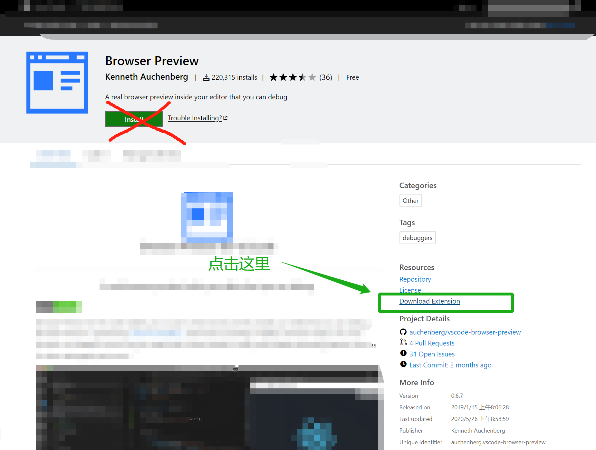
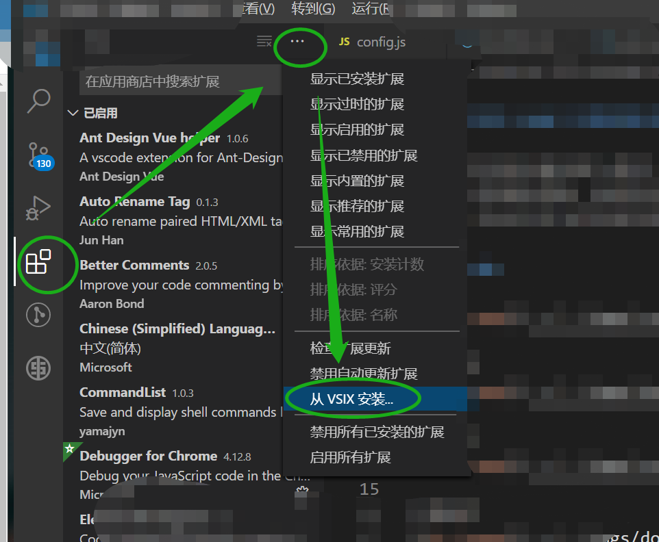

# 支持内网（LAN）环境的效率工具集

> 工具发明出来就是给人用的，任何工具2个小时都可以入门，只要一款工具使用频率较高，常用快捷键就应当要熟练掌握，这种意识可以帮助使用者每天减少1到2个小时的工作时间，甚至更久。

## Vscode 内网迁移及插件安装
下载安装包


插件下载


搜索插件


下载 .vsix 插件



按住 ```ctrl + j``` 查看下载好的 文件 后缀是 .vsix 

在内网安装插件


## Pxcook(标注，代码生成)

[官网](https://www.fancynode.com.cn/pxcook)

## InkScape(SVG)
[官网](https://inkscape.org/)

## FileZila(FTP)
[官网](https://filezilla-project.org/)

## XShell (终端模拟)

[官网](https://www.netsarang.com/zh/xshell/)

## Putty (TCP)
[官网](https://putty.en.softonic.com/)
开源的 Telnet、SSH、rlogin、纯TCP以及串行接口连接软件

## fiddler (抓包)
[官网](https://www.telerik.com/fiddler)

[ssh免密登录](https://www.wangt.cc/2020/06/%E5%85%B3%E4%BA%8Elinux%E5%85%8D%E5%AF%86%E7%99%BB%E5%BD%95%E5%8F%8Assh%E5%AE%A2%E6%88%B7%E7%AB%AF%E7%9A%84%E4%BD%BF%E7%94%A8/)

## Xmind8 (思维导图)
[官网](https://www.xmind.cn) 

